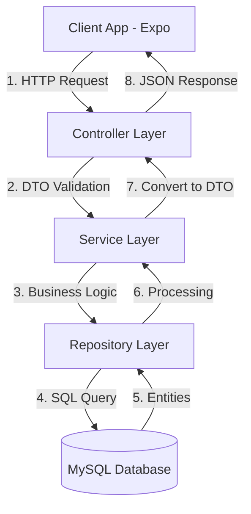

# Kiến Trúc Thư Mục & Cấu Trúc Dự Án Backend Java Spring Boot

Tài liệu này đặc tả chi tiết cấu trúc thư mục của Backend Java Spring Boot dành cho dự án **Pet Diary** để nhóm phát triển dự án dễ dàng tìm kiếm, xây dựng và tích hợp code dựa trên mã nguồn đã có.

---

## 1. Sơ Đồ Cấu Trúc Thư Mục Tổng Quan (Layered Architecture)

Mã nguồn được tổ chức theo kiến trúc phân lớp truyền thống (Layered Architecture) chuẩn của Spring Boot:

```text
src/
└── main/
    ├── java/
    │   └── com/
    │       └── petcare/
    │           └── backend/
    │               ├── BackendApplication.java # Class chính để chạy ứng dụng Spring Boot
    │               │
    │               ├── config/                  # Cấu hình hệ thống (Database, Swagger, CORS, Mail...)
    │               │
    │               ├── security/                # Cấu hình bảo mật Spring Security & JWT
    │               │   ├── JwtTokenProvider.java
    │               │   ├── JwtAuthenticationFilter.java
    │               │   └── WebSecurityConfig.java
    │               │
    │               ├── exception/               # Xử lý Exception tập trung
    │               │   ├── GlobalExceptionHandler.java # Bắt và xử lý lỗi của toàn API
    │               │   └── ResourceNotFoundException.java
    │               │
    │               ├── model/                   # Khai báo các Entity đại diện cho các bảng CSDL (JPA)
    │               │   ├── User.java            # Ánh xạ bảng `users`
    │               │   ├── Pet.java             # Ánh xạ bảng `pets`
    │               │   └── ...
    │               │
    │               ├── repository/              # Lớp giao tiếp DB (Spring Data JPA)
    │               │   ├── UserRepository.java  # Thực thi query trên bảng `users`
    │               │   ├── PetRepository.java   # Thực thi query trên bảng `pets`
    │               │   └── ...
    │               │
    │               ├── service/                 # Lớp logic nghiệp vụ chính (Business Logic)
    │               │   ├── UserService.java
    │               │   ├── PetService.java
    │               │   └── ...
    │               │
    │               ├── controller/              # Định nghĩa các REST API Endpoints
    │               │   ├── AuthController.java
    │               │   ├── PetController.java
    │               │   └── ...
    │               │
    │               └── dto/                     # Lớp trung chuyển dữ liệu (Request/Response DTOs)
    │                   ├── request/             # DTO nhận dữ liệu gửi từ App Expo
    │                   └── response/            # DTO gửi phản hồi về cho Client App
    │
    └── resources/
        ├── application.properties               # File cấu hình biến môi trường (Port, DB connection, JWT Secret)
        └── templates/                           # Nơi chứa mẫu Email (nếu cần gửi email xác thực OTP)
```

---

## 2. Chi Tiết Bản Đồ Phân Chia Lớp & Thao Tác CSDL

Trong kiến trúc phân lớp, một yêu cầu từ Client di động sẽ đi qua các tầng từ trên xuống dưới:



### Chi tiết vai trò từng tầng:
1. **Controller (`com.petcare.backend.controller`)**:
   - Tiếp nhận các HTTP Request từ thiết bị di động.
   - Sử dụng các annotations của Spring MVC như `@RestController`, `@RequestMapping`, `@PostMapping`, `@GetMapping`.
   - Kiểm tra dữ liệu đầu vào sử dụng `@Valid`.
2. **Service (`com.petcare.backend.service`)**:
   - Nơi xử lý toàn bộ logic nghiệp vụ (ví dụ: băm mật khẩu, so khớp OTP, tính toán ngày tiêm phòng tiếp theo).
   - Đảm bảo tính nhất quán của giao dịch cơ sở dữ liệu bằng cách sử dụng `@Transactional`.
3. **Repository (`com.petcare.backend.repository`)**:
   - Giao tiếp trực tiếp với cơ sở dữ liệu MySQL bằng Spring Data JPA.
   - Thừa kế từ `JpaRepository<Entity, IdType>` giúp tự động sinh ra các query CRUD cơ bản mà không cần viết SQL bằng tay.
4. **Model (`com.petcare.backend.model`)**:
   - Ánh xạ trực tiếp 1-1 với 28 bảng dữ liệu MySQL bằng các Hibernate annotations như `@Entity`, `@Table`, `@Id`, `@Column`, `@ManyToOne`, `@OneToMany`.
5. **DTO (`com.petcare.backend.dto`)**:
   - Đảm bảo tính bảo mật. Tránh trả về trực tiếp Entity Database cho Client (ví dụ: không trả về trường `password_hash` của người dùng).

---

## 3. Quy Tắc Lập Trình & Phối Hợp Dự Án
1. **Quản lý Dependencies**: Dự án sử dụng Maven. Mọi thư viện mới cần bổ sung phải được khai báo trong file [pom.xml](file:///d:/CMCU/doan/pom.xml).
2. **Môi trường cục bộ**: Cần cấu hình cấu hình kết nối CSDL MySQL (username, password, database url) trong file `src/main/resources/application.properties` (hoặc tạo file cấu hình `.env` dựa trên `.env.example`).
3. **Validate dữ liệu**: Sử dụng các Hibernate Validator như `@NotNull`, `@Email`, `@Size`, `@NotBlank` trong các class Request DTO để tự động kiểm soát chất lượng dữ liệu gửi lên từ ứng dụng Expo.
