# Thiết Kế Cơ Sở Dữ Liệu MySQL - Ứng Dụng Quản Lý Thú Cưng & Mạng Xã Hội (Phiên Bản MVP Tối Giản Tối Ưu Hóa)

Tài liệu này trình bày chi tiết thiết kế cơ sở dữ liệu MySQL đã được tối ưu hóa tối đa nhằm sửa đổi các lỗi bảo mật, lỗi ràng buộc dữ liệu (Foreign Key Constraints) và tối ưu hóa hiệu năng truy vấn cho ứng dụng di động (Expo) và Backend API.

---

## 1. Sơ Đồ Thực Thể Liên Kết (Mermaid ER Diagram)

Dưới đây là sơ đồ quan hệ giữa các bảng trong phiên bản tối giản tối ưu hóa:

```mermaid
erDiagram
    users {
        bigint id PK
        varchar email
        varchar password_hash
        varchar full_name
        varchar phone_number
        varchar avatar_url
        enum role
        enum status
        boolean is_online
        timestamp last_active_at
        varchar language
        varchar timezone
        boolean push_notifications_enabled
        timestamp created_at
        timestamp updated_at
    }
    user_social_accounts {
        bigint id PK
        bigint user_id FK
        enum provider
        varchar provider_user_id
        timestamp created_at
    }
    user_sessions {
        bigint id PK
        bigint user_id FK
        varchar refresh_token
        varchar device_token
        enum device_type
        varchar ip_address
        varchar user_agent
        boolean is_revoked
        timestamp expires_at
        timestamp created_at
        timestamp updated_at
    }
    password_resets {
        bigint id PK
        bigint user_id FK
        varchar email
        varchar otp_code
        varchar token
        timestamp expires_at
        boolean is_used
        timestamp created_at
    }
    categories_species {
        bigint id PK
        varchar name
        varchar icon_url
    }
    categories_breeds {
        bigint id PK
        bigint species_id FK
        varchar name
    }
    pets {
        bigint id PK
        bigint owner_id FK
        varchar name
        varchar avatar_url
        bigint species_id FK
        bigint breed_id FK
        enum gender
        date date_of_birth
        int estimated_age_months
        decimal current_weight
        text color_features
        enum spayed_status
        varchar microchip_number
        enum status
        text notes
        timestamp created_at
        timestamp updated_at
    }
    pet_co_parents {
        bigint id PK
        bigint pet_id FK
        bigint user_id FK
        enum role
        timestamp joined_at
        bigint invited_by FK
    }
    co_parent_invitations {
        bigint id PK
        bigint pet_id FK
        bigint inviter_id FK
        varchar invitee_email
        varchar invite_code
        enum role
        enum status
        timestamp expires_at
        timestamp created_at
    }
    pet_shares {
        bigint id PK
        bigint pet_id FK
        varchar share_token
        enum permissions
        bigint created_by FK
        timestamp expires_at
        timestamp created_at
    }
    vaccine_templates {
        bigint id PK
        bigint species_id FK
        varchar vaccine_name
        int dose_number
        int recommended_age_weeks
        text description
    }
    pet_vaccinations {
        bigint id PK
        bigint pet_id FK
        bigint vaccine_template_id FK
        varchar vaccine_name
        int dose_number
        enum status
        date scheduled_date
        date actual_date
        varchar administered_by
        varchar clinic_name
        decimal cost
        text notes
        varchar medical_proof_url
        timestamp created_at
        timestamp updated_at
    }
    care_reminders {
        bigint id PK
        bigint pet_id FK
        enum category
        varchar title
        text description
        time reminder_time
        enum frequency
        int interval_value
        date start_date
        date end_date
        date next_due_date
        int before_duration_minutes
        boolean is_active
        timestamp created_at
        timestamp updated_at
    }
    care_reminder_logs {
        bigint id PK
        bigint reminder_id FK
        date due_date
        enum status
        timestamp completed_at
        bigint completed_by FK
        timestamp snoozed_until
        timestamp created_at
        timestamp updated_at
    }
    weight_logs {
        bigint id PK
        bigint pet_id FK
        decimal weight
        date logged_date
        bigint logged_by FK
        timestamp created_at
    }
    health_conditions {
        bigint id PK
        bigint pet_id FK
        enum type
        varchar title
        text description
        date started_date
        date ended_date
        boolean is_active
        timestamp created_at
    }
    health_logs {
        bigint id PK
        bigint pet_id FK
        date logged_date
        enum appetite
        enum activity_level
        text abnormal_event
        text treatment_notes
        bigint logged_by FK
        timestamp created_at
        timestamp updated_at
    }
    emr_records {
        bigint id PK
        bigint pet_id FK
        enum record_type
        date visit_date
        varchar clinic_name
        varchar vet_name
        varchar vet_contact
        text diagnosis
        text prescription_details
        text notes
        text attachments
        bigint created_by FK
        timestamp created_at
        timestamp updated_at
    }
    posts {
        bigint id PK
        bigint user_id FK
        bigint pet_id FK
        text caption
        text images
        enum privacy
        enum status
        boolean comments_locked
        timestamp created_at
        timestamp updated_at
    }
    post_likes {
        bigint post_id PK_FK
        bigint user_id PK_FK
        timestamp created_at
    }
    post_comments {
        bigint id PK
        bigint post_id FK
        bigint user_id FK
        text comment_text
        enum status
        timestamp created_at
        timestamp updated_at
    }
    friendships {
        bigint user_id1 PK_FK
        bigint user_id2 PK_FK
        timestamp created_at
    }
    friend_requests {
        bigint id PK
        bigint sender_id FK
        bigint receiver_id FK
        enum status
        timestamp created_at
        timestamp updated_at
    }
    reports {
        bigint id PK
        bigint reporter_user_id FK
        enum target_type
        bigint target_id
        text reason
        enum status
        text moderator_notes
        bigint resolved_by FK
        timestamp created_at
        timestamp updated_at
    }
    admin_audits {
        bigint id PK
        bigint admin_id FK
        varchar action
        bigint target_id
        text details
        timestamp created_at
    }
    notifications {
        bigint id PK
        bigint user_id FK
        varchar title
        text content
        varchar type
        bigint reference_id
        boolean is_read
        timestamp read_at
        timestamp created_at
    }
    pet_timeline_events {
        bigint id PK
        bigint pet_id FK
        enum event_type
        bigint reference_id
        date event_date
        varchar summary
        timestamp created_at
    }
    admin_analytics_daily {
        date stat_date PK
        int total_users
        int total_pets
        int dau
        int mau
        int completed_reminders
        int total_posts
        int total_interactions
    }

    users ||--o{ user_social_accounts : "đăng nhập bằng"
    users ||--o{ password_resets : "yêu cầu reset"
    users ||--o{ pets : "chủ sở hữu chính (CASCADE)"
    users ||--o{ pet_co_parents : "đồng chăm sóc"
    users ||--o{ posts : "đăng tải"
    users ||--o{ post_likes : "thích bài viết"
    users ||--o{ post_comments : "bình luận"
    users ||--o{ friendships : "thiết lập bạn bè"
    users ||--o{ friend_requests : "gửi/nhận lời mời"
    users ||--o{ user_sessions : "sở hữu phiên làm việc"
    users ||--o{ notifications : "nhận thông báo"
    users ||--o{ pet_shares : "tạo liên kết chia sẻ"
    
    categories_species ||--o{ categories_breeds : "chứa"
    categories_species ||--o{ vaccine_templates : "có lịch tiêm mẫu"
    categories_species ||--o{ pets : "thuộc loài"
    categories_breeds ||--o{ pets : "thuộc giống"
    
    pets ||--o{ pet_co_parents : "được nuôi bởi"
    pets ||--o{ pet_vaccinations : "có lịch tiêm"
    pets ||--o{ care_reminders : "có nhắc nhở"
    pets ||--o{ weight_logs : "có nhật ký cân nặng"
    pets ||--o{ health_logs : "có nhật ký sức khỏe"
    pets ||--o{ health_conditions : "có bệnh lý"
    pets ||--o{ emr_records : "có hồ sơ EMR"
    pets ||--o{ pet_shares : "có liên kết chia sẻ"
    pets ||--o{ posts : "được gắn thẻ chính"
    
    posts ||--o{ post_likes : "nhận lượt thích"
    posts ||--o{ post_comments : "nhận bình luận"
    
    care_reminders ||--o{ care_reminder_logs : "lịch sử thực hiện"
    
    vaccine_templates ||--o{ pet_vaccinations : "sinh ra từ"
```



---

## 2. Thiết Kế Chi Tiết Các Bảng (Schema Design)

### Phân Hệ 1: Tài Khoản & Xác Thực (Users & Auth)

#### Bảng `users`
Lưu trữ tài khoản người dùng, trạng thái hoạt động/kiểm duyệt và cấu hình cá nhân hóa (gộp từ bảng `user_settings` cũ).

```sql
CREATE TABLE `users` (
  `id` BIGINT UNSIGNED NOT NULL AUTO_INCREMENT,
  `email` VARCHAR(255) NULL UNIQUE COMMENT 'Để NULL nếu chỉ login bằng Apple/Google không cung cấp email',
  `password_hash` VARCHAR(255) NULL COMMENT 'Mã hóa bcrypt, để NULL nếu login bằng mạng xã hội',
  `full_name` VARCHAR(255) NOT NULL,
  `phone_number` VARCHAR(20) NULL,
  `avatar_url` VARCHAR(255) NULL,
  `role` ENUM('user', 'admin', 'moderator') NOT NULL DEFAULT 'user',
  `status` ENUM('active', 'banned') NOT NULL DEFAULT 'active',
  `is_online` BOOLEAN NOT NULL DEFAULT FALSE,
  `last_active_at` TIMESTAMP NULL DEFAULT NULL,
  `language` VARCHAR(10) NOT NULL DEFAULT 'vi' COMMENT 'Ngôn ngữ cài đặt',
  `timezone` VARCHAR(50) NOT NULL DEFAULT 'Asia/Ho_Chi_Minh' COMMENT 'Múi giờ người dùng',
  `push_notifications_enabled` BOOLEAN NOT NULL DEFAULT TRUE COMMENT 'Bật/tắt thông báo đẩy',
  `created_at` TIMESTAMP NOT NULL DEFAULT CURRENT_TIMESTAMP,
  `updated_at` TIMESTAMP NOT NULL DEFAULT CURRENT_TIMESTAMP ON UPDATE CURRENT_TIMESTAMP,
  PRIMARY KEY (`id`),
  INDEX `idx_users_role_status` (`role`, `status`),
  INDEX `idx_users_email` (`email`)
) ENGINE=InnoDB DEFAULT CHARSET=utf8mb4 COLLATE=utf8mb4_unicode_ci;
```

#### Bảng `user_social_accounts`
Lưu trữ thông tin liên kết đăng nhập nhanh Google/Apple.

```sql
CREATE TABLE `user_social_accounts` (
  `id` BIGINT UNSIGNED NOT NULL AUTO_INCREMENT,
  `user_id` BIGINT UNSIGNED NOT NULL,
  `provider` ENUM('google', 'apple') NOT NULL,
  `provider_user_id` VARCHAR(255) NOT NULL COMMENT 'UID từ Google/Apple',
  `created_at` TIMESTAMP NOT NULL DEFAULT CURRENT_TIMESTAMP,
  PRIMARY KEY (`id`),
  UNIQUE KEY `uq_provider_user` (`provider`, `provider_user_id`),
  CONSTRAINT `fk_social_accounts_user` FOREIGN KEY (`user_id`) REFERENCES `users` (`id`) ON DELETE CASCADE
) ENGINE=InnoDB DEFAULT CHARSET=utf8mb4 COLLATE=utf8mb4_unicode_ci;
```

#### Bảng `user_sessions`
Lưu trữ phiên làm việc (refresh token) của người dùng để phục vụ cơ chế xác thực JWT và cấp lại Access Token, đồng thời lưu token thiết bị gửi thông báo đẩy (được gộp từ bảng `user_devices` cũ).

```sql
CREATE TABLE `user_sessions` (
  `id` BIGINT UNSIGNED NOT NULL AUTO_INCREMENT,
  `user_id` BIGINT UNSIGNED NOT NULL COMMENT 'Liên kết tới tài khoản người dùng',
  `refresh_token` VARCHAR(255) NOT NULL UNIQUE COMMENT 'Refresh token để cấp lại access token',
  `device_token` VARCHAR(255) NULL COMMENT 'Expo Push Token phục vụ gửi thông báo',
  `device_type` ENUM('ios', 'android', 'web') NULL COMMENT 'Loại thiết bị đăng nhập',
  `ip_address` VARCHAR(45) NULL COMMENT 'Địa chỉ IP đăng nhập',
  `user_agent` VARCHAR(255) NULL COMMENT 'Thông tin trình duyệt/thiết bị',
  `is_revoked` BOOLEAN NOT NULL DEFAULT FALSE COMMENT 'Trạng thái thu hồi/đăng xuất',
  `expires_at` TIMESTAMP NOT NULL COMMENT 'Thời gian hết hạn của token',
  `created_at` TIMESTAMP NOT NULL DEFAULT CURRENT_TIMESTAMP,
  `updated_at` TIMESTAMP NOT NULL DEFAULT CURRENT_TIMESTAMP ON UPDATE CURRENT_TIMESTAMP,
  PRIMARY KEY (`id`),
  INDEX `idx_sessions_user` (`user_id`),
  CONSTRAINT `fk_user_sessions_user` FOREIGN KEY (`user_id`) REFERENCES `users` (`id`) ON DELETE CASCADE
) ENGINE=InnoDB DEFAULT CHARSET=utf8mb4 COLLATE=utf8mb4_unicode_ci;
```

#### Bảng `password_resets`
**Tối ưu hóa:** Bổ sung cột `user_id` nhằm quản lý vòng đời mã OTP chính xác. Khi người dùng xác thực đổi mật khẩu thành công hoặc gửi yêu cầu mới, toàn bộ các mã OTP cũ chưa sử dụng của tài khoản đó sẽ được cập nhật thành `is_used = TRUE` để ngăn chặn lỗ hổng bảo mật.

```sql
CREATE TABLE `password_resets` (
  `id` BIGINT UNSIGNED NOT NULL AUTO_INCREMENT,
  `user_id` BIGINT UNSIGNED NOT NULL COMMENT 'Liên kết trực tiếp tới tài khoản cần reset',
  `email` VARCHAR(255) NOT NULL,
  `otp_code` VARCHAR(6) NOT NULL,
  `token` VARCHAR(255) NOT NULL UNIQUE,
  `expires_at` TIMESTAMP NOT NULL,
  `is_used` BOOLEAN NOT NULL DEFAULT FALSE,
  `created_at` TIMESTAMP NOT NULL DEFAULT CURRENT_TIMESTAMP,
  PRIMARY KEY (`id`),
  INDEX `idx_resets_user_otp` (`user_id`, `otp_code`),
  INDEX `idx_resets_email` (`email`),
  CONSTRAINT `fk_password_resets_user` FOREIGN KEY (`user_id`) REFERENCES `users` (`id`) ON DELETE CASCADE
) ENGINE=InnoDB DEFAULT CHARSET=utf8mb4 COLLATE=utf8mb4_unicode_ci;
```

---

### Phân Hệ 2: Quản Lý Hồ Sơ Thú Cưng (Pet Profile)

#### Bảng `pets`
**Tối ưu hóa:** Thay đổi ràng buộc khóa ngoại của trường `owner_id` từ `ON DELETE RESTRICT` thành `ON DELETE CASCADE`. Điều này giúp hệ thống tự động dọn dẹp các hồ sơ thú cưng khi tài khoản của chủ sở hữu chính bị xóa vật lý (nếu xóa hẳn tài khoản). Ngoài ra, nếu chỉ muốn vô hiệu hóa tài khoản vi phạm, quản trị viên sử dụng cập nhật trạng thái `users.status = 'banned'`.

```sql
CREATE TABLE `pets` (
  `id` BIGINT UNSIGNED NOT NULL AUTO_INCREMENT,
  `owner_id` BIGINT UNSIGNED NOT NULL COMMENT 'Chủ sở hữu chính tạo hồ sơ',
  `name` VARCHAR(100) NOT NULL,
  `avatar_url` VARCHAR(255) NULL,
  `species_id` BIGINT UNSIGNED NOT NULL,
  `breed_id` BIGINT UNSIGNED NOT NULL,
  `gender` ENUM('male', 'female', 'unknown') NOT NULL DEFAULT 'unknown',
  `date_of_birth` DATE NULL,
  `estimated_age_months` INT NULL,
  `current_weight` DECIMAL(5,2) NULL,
  `color_features` TEXT NULL,
  `spayed_status` ENUM('spayed', 'intact', 'unknown') NOT NULL DEFAULT 'unknown',
  `microchip_number` VARCHAR(100) NULL,
  `status` ENUM('active', 'archived', 'deceased') NOT NULL DEFAULT 'active',
  `notes` TEXT NULL,
  `created_at` TIMESTAMP NOT NULL DEFAULT CURRENT_TIMESTAMP,
  `updated_at` TIMESTAMP NOT NULL DEFAULT CURRENT_TIMESTAMP ON UPDATE CURRENT_TIMESTAMP,
  PRIMARY KEY (`id`),
  INDEX `idx_pets_owner` (`owner_id`),
  CONSTRAINT `fk_pets_owner` FOREIGN KEY (`owner_id`) REFERENCES `users` (`id`) ON DELETE CASCADE,
  CONSTRAINT `fk_pets_species` FOREIGN KEY (`species_id`) REFERENCES `categories_species` (`id`) ON DELETE RESTRICT,
  CONSTRAINT `fk_pets_breed` FOREIGN KEY (`breed_id`) REFERENCES `categories_breeds` (`id`) ON DELETE RESTRICT
) ENGINE=InnoDB DEFAULT CHARSET=utf8mb4 COLLATE=utf8mb4_unicode_ci;
```

#### Bảng `pet_co_parents`
Liên kết gia đình, phân quyền cùng quản lý thú cưng.

```sql
CREATE TABLE `pet_co_parents` (
  `id` BIGINT UNSIGNED NOT NULL AUTO_INCREMENT,
  `pet_id` BIGINT UNSIGNED NOT NULL,
  `user_id` BIGINT UNSIGNED NOT NULL,
  `role` ENUM('editor', 'viewer') NOT NULL DEFAULT 'viewer',
  `joined_at` TIMESTAMP NOT NULL DEFAULT CURRENT_TIMESTAMP,
  `invited_by` BIGINT UNSIGNED NOT NULL,
  PRIMARY KEY (`id`),
  UNIQUE KEY `uq_pet_user` (`pet_id`, `user_id`),
  CONSTRAINT `fk_co_parents_pet` FOREIGN KEY (`pet_id`) REFERENCES `pets` (`id`) ON DELETE CASCADE,
  CONSTRAINT `fk_co_parents_user` FOREIGN KEY (`user_id`) REFERENCES `users` (`id`) ON DELETE CASCADE,
  CONSTRAINT `fk_co_parents_inviter` FOREIGN KEY (`invited_by`) REFERENCES `users` (`id`) ON DELETE RESTRICT
) ENGINE=InnoDB DEFAULT CHARSET=utf8mb4 COLLATE=utf8mb4_unicode_ci;
```

#### Bảng `co_parent_invitations`
Quản lý mã mời chia sẻ quyền nuôi Pet.

```sql
CREATE TABLE `co_parent_invitations` (
  `id` BIGINT UNSIGNED NOT NULL AUTO_INCREMENT,
  `pet_id` BIGINT UNSIGNED NOT NULL,
  `inviter_id` BIGINT UNSIGNED NOT NULL,
  `invitee_email` VARCHAR(255) NULL,
  `invite_code` VARCHAR(20) NOT NULL UNIQUE,
  `role` ENUM('editor', 'viewer') NOT NULL DEFAULT 'viewer',
  `status` ENUM('pending', 'accepted', 'expired', 'revoked') NOT NULL DEFAULT 'pending',
  `expires_at` TIMESTAMP NOT NULL,
  `created_at` TIMESTAMP NOT NULL DEFAULT CURRENT_TIMESTAMP,
  PRIMARY KEY (`id`),
  CONSTRAINT `fk_invitations_pet` FOREIGN KEY (`pet_id`) REFERENCES `pets` (`id`) ON DELETE CASCADE,
  CONSTRAINT `fk_invitations_inviter` FOREIGN KEY (`inviter_id`) REFERENCES `users` (`id`) ON DELETE CASCADE
) ENGINE=InnoDB DEFAULT CHARSET=utf8mb4 COLLATE=utf8mb4_unicode_ci;
```

#### Bảng `pet_shares`
Tạo liên kết chia sẻ hoặc xuất file PDF y tế nhanh cho bác sĩ.

```sql
CREATE TABLE `pet_shares` (
  `id` BIGINT UNSIGNED NOT NULL AUTO_INCREMENT,
  `pet_id` BIGINT UNSIGNED NOT NULL,
  `share_token` VARCHAR(100) NOT NULL UNIQUE,
  `permissions` ENUM('public', 'restricted_medical') NOT NULL DEFAULT 'public',
  `created_by` BIGINT UNSIGNED NOT NULL COMMENT 'Người tạo link chia sẻ',
  `expires_at` TIMESTAMP NULL DEFAULT NULL,
  `created_at` TIMESTAMP NOT NULL DEFAULT CURRENT_TIMESTAMP,
  PRIMARY KEY (`id`),
  CONSTRAINT `fk_pet_shares_pet` FOREIGN KEY (`pet_id`) REFERENCES `pets` (`id`) ON DELETE CASCADE,
  CONSTRAINT `fk_pet_shares_creator` FOREIGN KEY (`created_by`) REFERENCES `users` (`id`) ON DELETE CASCADE
) ENGINE=InnoDB DEFAULT CHARSET=utf8mb4 COLLATE=utf8mb4_unicode_ci;
```

---

### Phân Hệ 3: Lịch Tiêm Phòng (Vaccination Schedule)

#### Bảng `vaccine_templates`
Lịch tiêm chủng gợi ý mẫu theo loài và số tuần tuổi.

```sql
CREATE TABLE `vaccine_templates` (
  `id` BIGINT UNSIGNED NOT NULL AUTO_INCREMENT,
  `species_id` BIGINT UNSIGNED NOT NULL,
  `vaccine_name` VARCHAR(150) NOT NULL,
  `dose_number` INT NOT NULL DEFAULT 1,
  `recommended_age_weeks` INT NOT NULL,
  `description` TEXT NULL,
  PRIMARY KEY (`id`),
  CONSTRAINT `fk_templates_species` FOREIGN KEY (`species_id`) REFERENCES `categories_species` (`id`) ON DELETE CASCADE
) ENGINE=InnoDB DEFAULT CHARSET=utf8mb4 COLLATE=utf8mb4_unicode_ci;
```

#### Bảng `pet_vaccinations`
Quản lý chi tiết lịch tiêm chủng đã thực hiện/dự kiến của thú cưng.

```sql
CREATE TABLE `pet_vaccinations` (
  `id` BIGINT UNSIGNED NOT NULL AUTO_INCREMENT,
  `pet_id` BIGINT UNSIGNED NOT NULL,
  `vaccine_template_id` BIGINT UNSIGNED NULL,
  `vaccine_name` VARCHAR(150) NOT NULL,
  `dose_number` INT NOT NULL DEFAULT 1,
  `status` ENUM('scheduled', 'completed', 'skipped', 'overdue') NOT NULL DEFAULT 'scheduled',
  `scheduled_date` DATE NOT NULL,
  `actual_date` DATE NULL,
  `administered_by` VARCHAR(150) NULL,
  `clinic_name` VARCHAR(150) NULL,
  `cost` DECIMAL(10,2) NULL,
  `notes` TEXT NULL,
  `medical_proof_url` VARCHAR(255) NULL,
  `created_at` TIMESTAMP NOT NULL DEFAULT CURRENT_TIMESTAMP,
  `updated_at` TIMESTAMP NOT NULL DEFAULT CURRENT_TIMESTAMP ON UPDATE CURRENT_TIMESTAMP,
  PRIMARY KEY (`id`),
  INDEX `idx_vaccinations_pet_status` (`pet_id`, `status`),
  CONSTRAINT `fk_vaccinations_pet` FOREIGN KEY (`pet_id`) REFERENCES `pets` (`id`) ON DELETE CASCADE,
  CONSTRAINT `fk_vaccinations_template` FOREIGN KEY (`vaccine_template_id`) REFERENCES `vaccine_templates` (`id`) ON DELETE SET NULL
) ENGINE=InnoDB DEFAULT CHARSET=utf8mb4 COLLATE=utf8mb4_unicode_ci;
```

---

### Phân Hệ 4: Nhắc Nhở Chăm Sóc (Care Reminders)

#### Bảng `care_reminders`
Lưu cấu hình tần suất và thời gian nhắc nhở (Tắm rửa, tẩy giun, cắt móng...).

```sql
CREATE TABLE `care_reminders` (
  `id` BIGINT UNSIGNED NOT NULL AUTO_INCREMENT,
  `pet_id` BIGINT UNSIGNED NOT NULL,
  `category` ENUM('vaccination', 'medical_checkup', 'deworming', 'bathing', 'nail_clipping', 'medication', 'other') NOT NULL,
  `title` VARCHAR(150) NOT NULL,
  `description` TEXT NULL,
  `reminder_time` TIME NOT NULL,
  `frequency` ENUM('once', 'daily', 'weekly', 'monthly', 'yearly') NOT NULL,
  `interval_value` INT NOT NULL DEFAULT 1,
  `start_date` DATE NOT NULL,
  `end_date` DATE NULL,
  `next_due_date` DATE NOT NULL,
  `before_duration_minutes` INT NOT NULL DEFAULT 0,
  `is_active` BOOLEAN NOT NULL DEFAULT TRUE,
  `created_at` TIMESTAMP NOT NULL DEFAULT CURRENT_TIMESTAMP,
  `updated_at` TIMESTAMP NOT NULL DEFAULT CURRENT_TIMESTAMP ON UPDATE CURRENT_TIMESTAMP,
  PRIMARY KEY (`id`),
  INDEX `idx_reminders_next_due` (`is_active`, `next_due_date`),
  CONSTRAINT `fk_reminders_pet` FOREIGN KEY (`pet_id`) REFERENCES `pets` (`id`) ON DELETE CASCADE
) ENGINE=InnoDB DEFAULT CHARSET=utf8mb4 COLLATE=utf8mb4_unicode_ci;
```

#### Bảng `care_reminder_logs`
**Xác thực thiết kế:** Trường `completed_by` tham chiếu đến bảng `users` được gán ràng buộc `ON DELETE SET NULL`. Thiết kế này là chính xác và được tối ưu hóa. Nếu một người dùng trong gia đình bị xóa khỏi hệ thống, nhật ký nhắc nhở y tế của thú cưng vẫn được giữ lại để lưu làm bệnh án lịch sử, chỉ có liên kết người hoàn thành được đưa về trống (NULL).

```sql
CREATE TABLE `care_reminder_logs` (
  `id` BIGINT UNSIGNED NOT NULL AUTO_INCREMENT,
  `reminder_id` BIGINT UNSIGNED NOT NULL,
  `due_date` DATE NOT NULL,
  `status` ENUM('pending', 'completed', 'snoozed', 'overdue') NOT NULL DEFAULT 'pending',
  `completed_at` TIMESTAMP NULL DEFAULT NULL,
  `completed_by` BIGINT UNSIGNED NULL COMMENT 'Khóa ngoại SET NULL khi User bị xóa để giữ lại vết y tế lịch sử của Pet',
  `snoozed_until` TIMESTAMP NULL DEFAULT NULL,
  `created_at` TIMESTAMP NOT NULL DEFAULT CURRENT_TIMESTAMP,
  `updated_at` TIMESTAMP NOT NULL DEFAULT CURRENT_TIMESTAMP ON UPDATE CURRENT_TIMESTAMP,
  PRIMARY KEY (`id`),
  CONSTRAINT `fk_reminder_logs_reminder` FOREIGN KEY (`reminder_id`) REFERENCES `care_reminders` (`id`) ON DELETE CASCADE,
  CONSTRAINT `fk_reminder_logs_completed_by` FOREIGN KEY (`completed_by`) REFERENCES `users` (`id`) ON DELETE SET NULL
) ENGINE=InnoDB DEFAULT CHARSET=utf8mb4 COLLATE=utf8mb4_unicode_ci;
```

---

### Phân Hệ 5: Theo Dõi Sức Khỏe Cơ Bản (Health Tracker)

#### Bảng `weight_logs`
Nhật ký cân nặng phục vụ vẽ biểu đồ biến động theo thời gian.

```sql
CREATE TABLE `weight_logs` (
  `id` BIGINT UNSIGNED NOT NULL AUTO_INCREMENT,
  `pet_id` BIGINT UNSIGNED NOT NULL,
  `weight` DECIMAL(5,2) NOT NULL,
  `logged_date` DATE NOT NULL,
  `logged_by` BIGINT UNSIGNED NOT NULL,
  `created_at` TIMESTAMP NOT NULL DEFAULT CURRENT_TIMESTAMP,
  PRIMARY KEY (`id`),
  INDEX `idx_weight_pet_date` (`pet_id`, `logged_date`),
  CONSTRAINT `fk_weight_logs_pet` FOREIGN KEY (`pet_id`) REFERENCES `pets` (`id`) ON DELETE CASCADE,
  CONSTRAINT `fk_weight_logs_user` FOREIGN KEY (`logged_by`) REFERENCES `users` (`id`) ON DELETE RESTRICT
) ENGINE=InnoDB DEFAULT CHARSET=utf8mb4 COLLATE=utf8mb4_unicode_ci;
```

#### Bảng `health_conditions`
Lưu thông tin dị ứng, bệnh mãn tính hoặc danh sách thuốc lá đang uống.

```sql
CREATE TABLE `health_conditions` (
  `id` BIGINT UNSIGNED NOT NULL AUTO_INCREMENT,
  `pet_id` BIGINT UNSIGNED NOT NULL,
  `type` ENUM('allergy', 'chronic_disease', 'current_medication', 'other') NOT NULL,
  `title` VARCHAR(150) NOT NULL,
  `description` TEXT NULL,
  `started_date` DATE NULL,
  `ended_date` DATE NULL,
  `is_active` BOOLEAN NOT NULL DEFAULT TRUE,
  `created_at` TIMESTAMP NOT NULL DEFAULT CURRENT_TIMESTAMP,
  PRIMARY KEY (`id`),
  CONSTRAINT `fk_conditions_pet` FOREIGN KEY (`pet_id`) REFERENCES `pets` (`id`) ON DELETE CASCADE
) ENGINE=InnoDB DEFAULT CHARSET=utf8mb4 COLLATE=utf8mb4_unicode_ci;
```

#### Bảng `health_logs`
Nhật ký ăn uống, vận động và sự kiện bất thường (nôn, sốt, uể oải).

```sql
CREATE TABLE `health_logs` (
  `id` BIGINT UNSIGNED NOT NULL AUTO_INCREMENT,
  `pet_id` BIGINT UNSIGNED NOT NULL,
  `logged_date` DATE NOT NULL,
  `appetite` ENUM('normal', 'poor', 'no_food', 'excessive') NOT NULL DEFAULT 'normal',
  `activity_level` ENUM('very_active', 'active', 'moderate', 'low') NOT NULL DEFAULT 'moderate',
  `abnormal_event` TEXT NULL,
  `treatment_notes` TEXT NULL,
  `logged_by` BIGINT UNSIGNED NOT NULL,
  `created_at` TIMESTAMP NOT NULL DEFAULT CURRENT_TIMESTAMP,
  `updated_at` TIMESTAMP NOT NULL DEFAULT CURRENT_TIMESTAMP ON UPDATE CURRENT_TIMESTAMP,
  PRIMARY KEY (`id`),
  UNIQUE KEY `uq_pet_logged_date` (`pet_id`, `logged_date`),
  CONSTRAINT `fk_health_logs_pet` FOREIGN KEY (`pet_id`) REFERENCES `pets` (`id`) ON DELETE CASCADE,
  CONSTRAINT `fk_health_logs_user` FOREIGN KEY (`logged_by`) REFERENCES `users` (`id`) ON DELETE RESTRICT
) ENGINE=InnoDB DEFAULT CHARSET=utf8mb4 COLLATE=utf8mb4_unicode_ci;
```

---

### Phân Hệ 6: Hồ Sơ Y Tế Điện Tử (Electronic Medical Record - EMR)

#### Bảng `emr_records`
Bệnh án điện tử, chẩn đoán, đơn thuốc từ bác sĩ, tích hợp trực tiếp cột đính kèm dưới dạng JSON (gộp từ bảng `emr_attachments` cũ).

```sql
CREATE TABLE `emr_records` (
  `id` BIGINT UNSIGNED NOT NULL AUTO_INCREMENT,
  `pet_id` BIGINT UNSIGNED NOT NULL,
  `record_type` ENUM('visit', 'prescription', 'lab_result', 'surgery', 'other') NOT NULL,
  `visit_date` DATE NOT NULL,
  `clinic_name` VARCHAR(150) NULL,
  `vet_name` VARCHAR(150) NULL,
  `vet_contact` VARCHAR(50) NULL,
  `diagnosis` TEXT NOT NULL,
  `prescription_details` TEXT NULL,
  `notes` TEXT NULL,
  `attachments` TEXT NULL COMMENT 'Mảng JSON tệp đính kèm: [{"file_name": "xray.jpg", "file_url": "url", "file_type": "image/jpeg"}]',
  `created_by` BIGINT UNSIGNED NOT NULL,
  `created_at` TIMESTAMP NOT NULL DEFAULT CURRENT_TIMESTAMP,
  `updated_at` TIMESTAMP NOT NULL DEFAULT CURRENT_TIMESTAMP ON UPDATE CURRENT_TIMESTAMP,
  PRIMARY KEY (`id`),
  CONSTRAINT `fk_emr_records_pet` FOREIGN KEY (`pet_id`) REFERENCES `pets` (`id`) ON DELETE CASCADE,
  CONSTRAINT `fk_emr_records_user` FOREIGN KEY (`created_by`) REFERENCES `users` (`id`) ON DELETE RESTRICT
) ENGINE=InnoDB DEFAULT CHARSET=utf8mb4 COLLATE=utf8mb4_unicode_ci;
```

---

### Phân Hệ 7: Mạng Xã Hội (Tối Giản Cho MVP)

#### Bảng `posts`
**Tối ưu hóa:** Loại bỏ hoàn toàn bảng phụ `post_images` để giảm thiểu các câu lệnh `JOIN` dữ liệu nặng nề làm chậm API Bảng tin. Tích hợp cột `images` kiểu dữ liệu `TEXT` ngay trong bảng `posts` để lưu trữ trực tiếp mảng JSON chứa các URL ảnh (ví dụ: `["url1", "url2", "url3"]`). Ngoài ra, bảng liên kết đa hình `post_pet_tags` cũng được loại bỏ để thay thế bằng trường liên kết trực tiếp `pet_id` (nếu bài viết gắn liền với một bé thú cưng cụ thể).

```sql
CREATE TABLE `posts` (
  `id` BIGINT UNSIGNED NOT NULL AUTO_INCREMENT,
  `user_id` BIGINT UNSIGNED NOT NULL COMMENT 'Người đăng bài',
  `pet_id` BIGINT UNSIGNED NULL COMMENT 'Bài đăng thuộc về bé thú cưng cụ thể (Phục vụ gom Album và lọc timeline)',
  `caption` TEXT NULL,
  `images` TEXT NULL COMMENT 'Mảng JSON lưu URLs ảnh: ["url1", "url2"] để loại bỏ JOIN bảng phụ',
  `privacy` ENUM('private', 'friends') NOT NULL DEFAULT 'friends',
  `status` ENUM('published', 'hidden', 'deleted') NOT NULL DEFAULT 'published',
  `comments_locked` BOOLEAN NOT NULL DEFAULT FALSE,
  `created_at` TIMESTAMP NOT NULL DEFAULT CURRENT_TIMESTAMP,
  `updated_at` TIMESTAMP NOT NULL DEFAULT CURRENT_TIMESTAMP ON UPDATE CURRENT_TIMESTAMP,
  PRIMARY KEY (`id`),
  INDEX `idx_posts_user_status` (`user_id`, `status`),
  INDEX `idx_posts_pet` (`pet_id`),
  CONSTRAINT `fk_posts_user` FOREIGN KEY (`user_id`) REFERENCES `users` (`id`) ON DELETE CASCADE,
  CONSTRAINT `fk_posts_pet` FOREIGN KEY (`pet_id`) REFERENCES `pets` (`id`) ON DELETE SET NULL
) ENGINE=InnoDB DEFAULT CHARSET=utf8mb4 COLLATE=utf8mb4_unicode_ci;
```

#### Bảng `post_likes`
Quản lý lượt thích. Khóa chính `(post_id, user_id)` tránh tình trạng spam trùng lặp.

```sql
CREATE TABLE `post_likes` (
  `post_id` BIGINT UNSIGNED NOT NULL,
  `user_id` BIGINT UNSIGNED NOT NULL,
  `created_at` TIMESTAMP NOT NULL DEFAULT CURRENT_TIMESTAMP,
  PRIMARY KEY (`post_id`, `user_id`),
  CONSTRAINT `fk_likes_post` FOREIGN KEY (`post_id`) REFERENCES `posts` (`id`) ON DELETE CASCADE,
  CONSTRAINT `fk_likes_user` FOREIGN KEY (`user_id`) REFERENCES `users` (`id`) ON DELETE CASCADE
) ENGINE=InnoDB DEFAULT CHARSET=utf8mb4 COLLATE=utf8mb4_unicode_ci;
```

#### Bảng `post_comments`
Quản lý bình luận 1 cấp tối giản (Flat list). Bỏ cơ chế lồng đệ quy để tối ưu tốc độ render UI trên App Expo.

```sql
CREATE TABLE `post_comments` (
  `id` BIGINT UNSIGNED NOT NULL AUTO_INCREMENT,
  `post_id` BIGINT UNSIGNED NOT NULL,
  `user_id` BIGINT UNSIGNED NOT NULL,
  `comment_text` TEXT NOT NULL,
  `status` ENUM('visible', 'deleted') NOT NULL DEFAULT 'visible',
  `created_at` TIMESTAMP NOT NULL DEFAULT CURRENT_TIMESTAMP,
  `updated_at` TIMESTAMP NOT NULL DEFAULT CURRENT_TIMESTAMP ON UPDATE CURRENT_TIMESTAMP,
  PRIMARY KEY (`id`),
  INDEX `idx_comments_post` (`post_id`),
  CONSTRAINT `fk_comments_post` FOREIGN KEY (`post_id`) REFERENCES `posts` (`id`) ON DELETE CASCADE,
  CONSTRAINT `fk_comments_user` FOREIGN KEY (`user_id`) REFERENCES `users` (`id`) ON DELETE CASCADE
) ENGINE=InnoDB DEFAULT CHARSET=utf8mb4 COLLATE=utf8mb4_unicode_ci;
```

#### Bảng `friendships`
Quản lý mối quan hệ bạn bè đã được chấp nhận hai chiều đồng thuận (Zalo / Locket style). Để tối ưu hiệu năng và tránh trùng lặp quan hệ như (1, 2) và (2, 1), luôn ràng buộc `user_id1 < user_id2`.

```sql
CREATE TABLE `friendships` (
  `user_id1` BIGINT UNSIGNED NOT NULL COMMENT 'ID người dùng 1 (Luôn nhỏ hơn user_id2)',
  `user_id2` BIGINT UNSIGNED NOT NULL COMMENT 'ID người dùng 2 (Luôn lớn hơn user_id1)',
  `created_at` TIMESTAMP NOT NULL DEFAULT CURRENT_TIMESTAMP,
  PRIMARY KEY (`user_id1`, `user_id2`),
  INDEX `idx_friendships_user2` (`user_id2`),
  CONSTRAINT `chk_user_order` CHECK (`user_id1` < `user_id2`),
  CONSTRAINT `fk_friendships_user1` FOREIGN KEY (`user_id1`) REFERENCES `users` (`id`) ON DELETE CASCADE,
  CONSTRAINT `fk_friendships_user2` FOREIGN KEY (`user_id2`) REFERENCES `users` (`id`) ON DELETE CASCADE
) ENGINE=InnoDB DEFAULT CHARSET=utf8mb4 COLLATE=utf8mb4_unicode_ci;
```

#### Bảng `friend_requests`
Quản lý các yêu cầu gửi lời mời kết bạn giữa người dùng.

```sql
CREATE TABLE `friend_requests` (
  `id` BIGINT UNSIGNED NOT NULL AUTO_INCREMENT,
  `sender_id` BIGINT UNSIGNED NOT NULL COMMENT 'Người gửi lời mời',
  `receiver_id` BIGINT UNSIGNED NOT NULL COMMENT 'Người nhận lời mời',
  `status` ENUM('pending', 'accepted', 'declined') NOT NULL DEFAULT 'pending',
  `created_at` TIMESTAMP NOT NULL DEFAULT CURRENT_TIMESTAMP,
  `updated_at` TIMESTAMP NOT NULL DEFAULT CURRENT_TIMESTAMP ON UPDATE CURRENT_TIMESTAMP,
  PRIMARY KEY (`id`),
  UNIQUE KEY `uq_sender_receiver` (`sender_id`, `receiver_id`),
  INDEX `idx_friend_requests_receiver_status` (`receiver_id`, `status`),
  CONSTRAINT `fk_friend_requests_sender` FOREIGN KEY (`sender_id`) REFERENCES `users` (`id`) ON DELETE CASCADE,
  CONSTRAINT `fk_friend_requests_receiver` FOREIGN KEY (`receiver_id`) REFERENCES `users` (`id`) ON DELETE CASCADE
) ENGINE=InnoDB DEFAULT CHARSET=utf8mb4 COLLATE=utf8mb4_unicode_ci;
```

---

### Phân Hệ 8: Hệ Thống Báo Cáo & Danh Mục Admin

#### Bảng `categories_species`
Danh mục loài (Chó, Mèo, Chim...).

```sql
CREATE TABLE `categories_species` (
  `id` BIGINT UNSIGNED NOT NULL AUTO_INCREMENT,
  `name` VARCHAR(50) NOT NULL UNIQUE,
  `icon_url` VARCHAR(255) NULL,
  PRIMARY KEY (`id`)
) ENGINE=InnoDB DEFAULT CHARSET=utf8mb4 COLLATE=utf8mb4_unicode_ci;
```

#### Bảng `categories_breeds`
Danh mục giống tương ứng theo loài.

```sql
CREATE TABLE `categories_breeds` (
  `id` BIGINT UNSIGNED NOT NULL AUTO_INCREMENT,
  `species_id` BIGINT UNSIGNED NOT NULL,
  `name` VARCHAR(100) NOT NULL,
  PRIMARY KEY (`id`),
  UNIQUE KEY `uq_species_breed` (`species_id`, `name`),
  CONSTRAINT `fk_breeds_species` FOREIGN KEY (`species_id`) REFERENCES `categories_species` (`id`) ON DELETE CASCADE
) ENGINE=InnoDB DEFAULT CHARSET=utf8mb4 COLLATE=utf8mb4_unicode_ci;
```

#### Bảng `reports`
Hệ thống báo cáo bài viết/comment xấu.

```sql
CREATE TABLE `reports` (
  `id` BIGINT UNSIGNED NOT NULL AUTO_INCREMENT,
  `reporter_user_id` BIGINT UNSIGNED NOT NULL,
  `target_type` ENUM('post', 'comment', 'user') NOT NULL,
  `target_id` BIGINT UNSIGNED NOT NULL,
  `reason` TEXT NOT NULL,
  `status` ENUM('pending', 'reviewed', 'ignored', 'resolved') NOT NULL DEFAULT 'pending',
  `moderator_notes` TEXT NULL,
  `resolved_by` BIGINT UNSIGNED NULL,
  `created_at` TIMESTAMP NOT NULL DEFAULT CURRENT_TIMESTAMP,
  `updated_at` TIMESTAMP NOT NULL DEFAULT CURRENT_TIMESTAMP ON UPDATE CURRENT_TIMESTAMP,
  PRIMARY KEY (`id`),
  CONSTRAINT `fk_reports_reporter` FOREIGN KEY (`reporter_user_id`) REFERENCES `users` (`id`) ON DELETE CASCADE,
  CONSTRAINT `fk_reports_resolver` FOREIGN KEY (`resolved_by`) REFERENCES `users` (`id`) ON DELETE SET NULL
) ENGINE=InnoDB DEFAULT CHARSET=utf8mb4 COLLATE=utf8mb4_unicode_ci;
```

#### Bảng `admin_audits`
Lịch sử tác động nghiệp vụ kiểm duyệt của Admin.

```sql
CREATE TABLE `admin_audits` (
  `id` BIGINT UNSIGNED NOT NULL AUTO_INCREMENT,
  `admin_id` BIGINT UNSIGNED NOT NULL,
  `action` VARCHAR(100) NOT NULL,
  `target_id` BIGINT UNSIGNED NULL,
  `details` TEXT NULL,
  `created_at` TIMESTAMP NOT NULL DEFAULT CURRENT_TIMESTAMP,
  PRIMARY KEY (`id`),
  CONSTRAINT `fk_audits_admin` FOREIGN KEY (`admin_id`) REFERENCES `users` (`id`) ON DELETE RESTRICT
) ENGINE=InnoDB DEFAULT CHARSET=utf8mb4 COLLATE=utf8mb4_unicode_ci;
```

#### Bảng `notifications`
Lưu trữ thông tin lịch sử thông báo gửi tới người dùng phục vụ in-app notification center và push notification logs.

```sql
CREATE TABLE `notifications` (
  `id` BIGINT UNSIGNED NOT NULL AUTO_INCREMENT,
  `user_id` BIGINT UNSIGNED NOT NULL COMMENT 'Người nhận thông báo',
  `title` VARCHAR(255) NOT NULL,
  `content` TEXT NOT NULL,
  `type` VARCHAR(50) NOT NULL COMMENT 'vaccine_reminder, medical_checkup, new_follower, post_like, post_comment, co_parent_invite, co_parent_accepted, pet_shared, system',
  `reference_id` BIGINT UNSIGNED NULL COMMENT 'ID của đối tượng liên quan (post_id, pet_id, reminder_log_id, etc.)',
  `is_read` BOOLEAN NOT NULL DEFAULT FALSE,
  `read_at` TIMESTAMP NULL DEFAULT NULL,
  `created_at` TIMESTAMP NOT NULL DEFAULT CURRENT_TIMESTAMP,
  PRIMARY KEY (`id`),
  INDEX `idx_notifications_user_read` (`user_id`, `is_read`),
  CONSTRAINT `fk_notifications_user` FOREIGN KEY (`user_id`) REFERENCES `users` (`id`) ON DELETE CASCADE
) ENGINE=InnoDB DEFAULT CHARSET=utf8mb4 COLLATE=utf8mb4_unicode_ci;
```

---

## 3. Các Giải Phép Tối Ưu Hóa & Đồng Bộ Hóa

### 3.1. Truy Vấn Album Ảnh Của Thú Cưng (Cực Kỳ Đơn Giản)
Nhờ liên kết trực tiếp `posts.pet_id`, việc lấy album ảnh cho Pet được tối giản hóa, không cần join nhiều bảng:

```sql
SELECT images, id AS post_id, created_at
FROM posts
WHERE pet_id = :pet_id 
  AND status = 'published'
ORDER BY created_at DESC;
```

### 3.2. Cảnh báo đồng bộ hóa cho bảng `pet_timeline_events`
Bảng `pet_timeline_events` hoạt động theo mô hình phi chuẩn hóa (Denormalization) để phục vụ việc hiển thị dòng thời gian tích hợp nhanh chóng. Để tránh hiện tượng lệch dữ liệu (Data Desynchronization):
* **Giải pháp 1 (Application Service - Khuyên dùng):** Trong code Backend Service, các hàm xóa bài viết (`deletePost`), cập nhật cân nặng (`updateWeight`), cập nhật mũi tiêm (`updateVaccination`) cần gọi thêm hàm xóa/cập nhật tương ứng trong bảng sự kiện timeline.
* **Giải pháp 2 (Database Trigger):** Sử dụng các triggers trực tiếp trong MySQL để tự động xóa bản ghi trong bảng `pet_timeline_events` khi bản ghi ở bảng gốc bị xóa vật lý. Ví dụ:
  ```sql
  CREATE TRIGGER `after_post_delete` 
  AFTER DELETE ON `posts`
  FOR EACH ROW 
  BEGIN
    DELETE FROM `pet_timeline_events` 
    WHERE `event_type` = 'social_post' AND `reference_id` = OLD.id;
  END;
  ```
